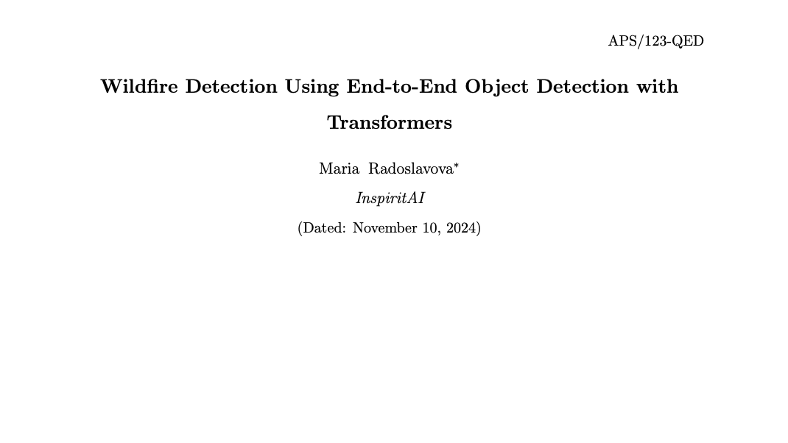
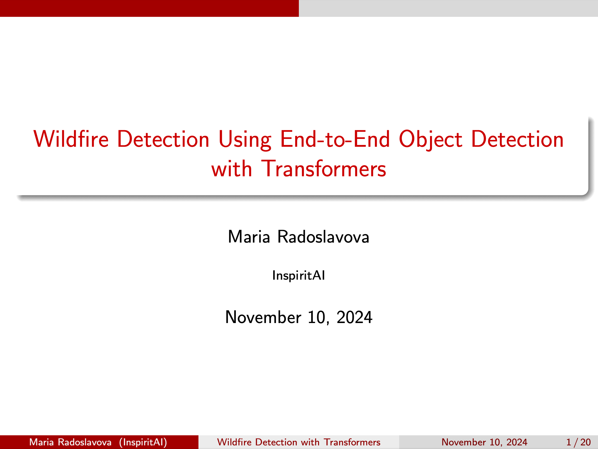

# Forest-Fire Detection Project

## Overview

This project focuses on detecting wildfires using advanced object detection models. The repository provides tools for downloading datasets, preprocessing images, training detection models, and visualizing results. Key components include scripts for dataset preparation, training using the DEtection TRansformer (DETR), and evaluating model performance.

## Table of Contents
- [Overview](#overview)
- [Getting Started](#getting-started)
  - [Prerequisites](#prerequisites)
  - [Installation](#installation)
- [Usage](#usage)
  - [train.py](#trainpy)
  - [test.py](#testpy)
  - [inference.py](#inferencepy)
- [Project Structure](#project-structure)
- [Paper and Presentation Preview](#paper-and-presentation-preview)
- [References](#references)

## Getting Started

### Prerequisites

Ensure you have the following prerequisites installed:
- Python 3.7 or higher
- Required Python packages (see `requirements.txt`)

### Installation

Clone the repository and install dependencies:

```bash
git clone https://github.com/YourUsername/Forest-Fire-Detection.git
cd Forest-Fire-Detection
pip install -r requirements.txt
```

## Usage

### train.py

The `train.py` script is designed to facilitate the training of object detection models on the wildfire dataset. This script initializes the model, processes the data, and runs the training loop, allowing for customization of parameters such as learning rate and batch size.

- **Model Configuration**: Allows setup of the DEtection TRansformer (DETR) model with configurable hyperparameters.
- **Training**: Runs through multiple epochs to improve model accuracy in detecting wildfires in diverse environmental conditions.
- **Logging**: Provides logs of training and validation loss for monitoring model performance.

- **Usage**:
  ```bash
  python train.py
  ```

### test.py

The `test.py` script is used to evaluate the trained model on a designated test dataset. It outputs key performance metrics, which can help assess how well the model generalizes to unseen data.

- **Evaluation Metrics**: Computes accuracy, precision, recall, and F1-score to assess model performance.
- **Confusion Matrix**: Visualizes the classification results for further analysis.

- **Usage**:
  ```bash
  python test.py
  ```

### inference.py

`inference.py` provides inference capabilities, allowing users to detect wildfires in new images using the trained model. This script supports both single image and batch inference modes.

- **Input**: Accepts a path to an image or a folder of images for processing.
- **Output**: Saves annotated images to the specified output directory, highlighting detected wildfire regions.

- **Usage**:
  ```bash
  python inference.py --input path/to/image_or_folder --output path/to/output_dir
  ```

## Project Structure

- `requirements.txt` - Lists all necessary packages and libraries.
- `train.py` - Script for model training.
- `test.py` - Script for model evaluation on test data.
- `inference.py` - Script for running inference on new data.
- `src/` - Contains various helper scripts for data preprocessing and analysis:
  - `download_dataset.py` - Downloads and organizes the dataset.
  - `train_detr.py` - Trains the DETR model.
  - `analyze_annotations.py` - Analyzes dataset annotations.
  - `organize_images.py` - Structures images for model input.
  - `produce_overlays.py` - Produces overlays for visual analysis.

## Paper and Presentation Preview

### Paper Preview

You can view a preview of the paper for this project by clicking the link below:

[](assets/Wildfire_Detection.pdf)

This link will open the PDF paper directly in your browser.

### Presentation Preview

You can view a preview of the presentation for this project by clicking the link below:

[](assets/Maria_Forest_Fire_Presentation.pdf)

This link will open the PDF presentation directly in your browser.

## References

This project builds on the DEtection TRansformer (DETR) model and uses COCO-style datasets for training and validation.
